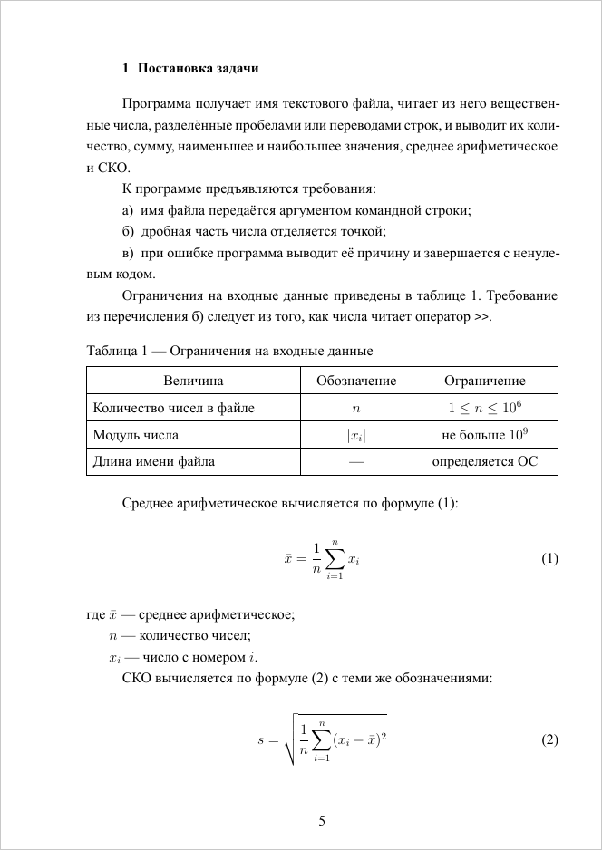
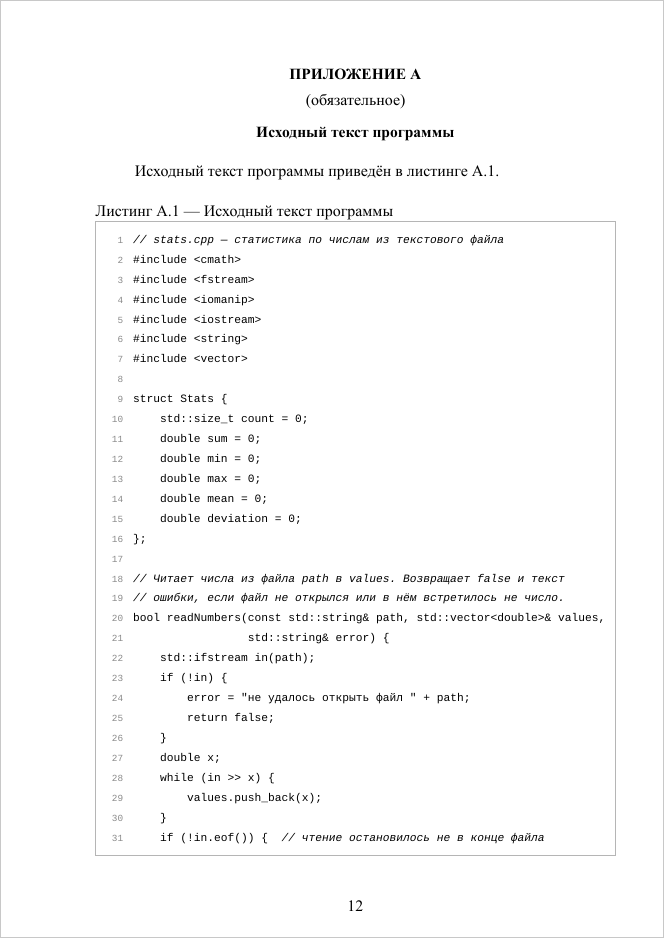

# suai-report

Шаблон отчёта ГУАП по ГОСТ 7.32-2017 на XeLaTeX. Титульный лист совпадает
с официальным бланком, остальное оформление ставится само — в `main.tex`
пишется только текст.

<p align="center">
  
  
  
</p>

Это страницы демо-отчёта: исходник — [demo/main.tex](demo/main.tex), готовый
PDF приложен к [последнему релизу](https://github.com/Echways/suai-report/releases/latest).

## Быстрый старт

Нужны TeX Live (`xelatex`, `latexmk`, `biber`) и Python 3.10 или новее;
удобнее всего работать в VS Code с расширением LaTeX Workshop.

```bash
git clone https://github.com/Echways/suai-report
cd suai-report
make install                              # Windows: py scripts\suai.py install
suai new ../lab-1 --title "Название работы"
```

Откроется VS Code. В `main.tex` нажми **Ctrl+Alt+V** — справа появится PDF,
который пересобирается при каждом сохранении. Готовый файл лежит рядом
с `main.tex` и называется по двум папкам: `Databases/lab-3/main.tex` →
`Databases-lab-3.pdf`. Следующая лаба с тем же титулом — `suai next`.

Подробно, в том числе Windows, MiKTeX и работа без команды `suai`, —
в [docs/install.md](docs/install.md).

## Как выглядит отчёт

Блочная команда читает строки под собой **до пустой строки**: каждая
строка становится пунктом списка, строкой таблицы или пояснением
к формуле. Код под `\suaicode` пишется с отступом.

```latex
\suaiintro

Цель работы — освоить чтение данных из текстового файла.

\suaitasks
изучить классы файловых потоков
написать и проверить программу

\section{Ход работы}

Схема алгоритма показана на~\figref{scheme}, способы чтения сравниваются
в~\tabref{reading}.

\suaiimg{scheme}{Схема алгоритма программы}

\suaitable[reading]{Способы чтения из потока}
Способ              | Что читает
\texttt{in >> x}    | одно значение
\texttt{in.get(c)}  | один символ

\suaieq[mean]{\bar{x} = \frac{1}{n} \sum_{i=1}^{n} x_i}
\bar{x} | среднее арифметическое
n | количество чисел

\suaicode[bash, build]{Сборка программы}
    g++ -std=c++17 -o stats stats.cpp

\suaiconclusion

Программа написана и проверена.

\suaisources
Страуструп Б. Язык программирования C++. М.: Бином, 2011. 1136 с.
```

## Команды

| Команда | Что делает |
| --- | --- |
| `\suaisetup{…}`, `\maketitle` | [титульный лист](docs/title.md) |
| `\suaitoc` | содержание |
| `\suaiintro`, `\suaiconclusion` | введение, заключение |
| `\suaisection{Название}` | другой структурный элемент без номера |
| `\suaitasks` | «Для достижения цели…» и задачи а), б), в) |
| `\suaienum` / `\suailist` / `\suainum` | перечисление а) б) / через тире / 1) 2) |
| `\suaitable[метка]{Название}` | таблица: ячейки через `\|`, первая строка — шапка |
| `\suaiimg[ширина]{файл}{Подпись}` | рисунок из `images/`, метка `fig:файл` |
| `\suaieq[метка]{формула}` | формула, строки `обозначение \| смысл` дают «где …» |
| `\suaicode[язык, метка]{Подпись}` | листинг: код строками с отступом под командой |
| `\suaicode[язык]{файл}{Подпись}` | листинг из файла, метка `lst:файл` |
| `\suaisources` | список источников, по одному на строку |
| `\suaiapp[статус]{Название}` | приложение А, Б, … |
| `\figref`, `\tabref`, `\lstref`, `\formref` | «рисунке 1», «таблице 1», «листинге 1», «формуле (1)» |

У каждой команды есть свой раздел с примером
в [docs/writing.md](docs/writing.md).

## Документация

| Страница | О чём |
| --- | --- |
| [Установка](docs/install.md) | Linux, macOS, Windows, шрифты, обновление, удаление, работа без `suai` |
| [Команда `suai`](docs/cli.md) | новый отчёт, сборка, откуда берётся титул, имя PDF |
| [Титульный лист](docs/title.md) | все ключи `\suaisetup` и особые случаи |
| [Текст отчёта](docs/writing.md) | правило блоков, списки, таблицы, рисунки, формулы, листинги, источники, приложения |
| [Настройка под методичку](docs/customization.md) | поля, интервал, заголовки, листинги, свои таблицы, biblatex |
| [VS Code](docs/vscode.md) | предпросмотр, подсказки, сниппеты |
| [Что шаблон делает по ГОСТ](docs/gost.md) | оформление по пунктам ГОСТ 7.32-2017 |
| [Если что-то не так](docs/troubleshooting.md) | сообщения пакета и частые ошибки |
| [Разработка](docs/development.md) | устройство репозитория, тесты, выпуск версии |

Что менялось от версии к версии — в [CHANGELOG.md](CHANGELOG.md).

## Лицензия

[MIT](LICENSE)
