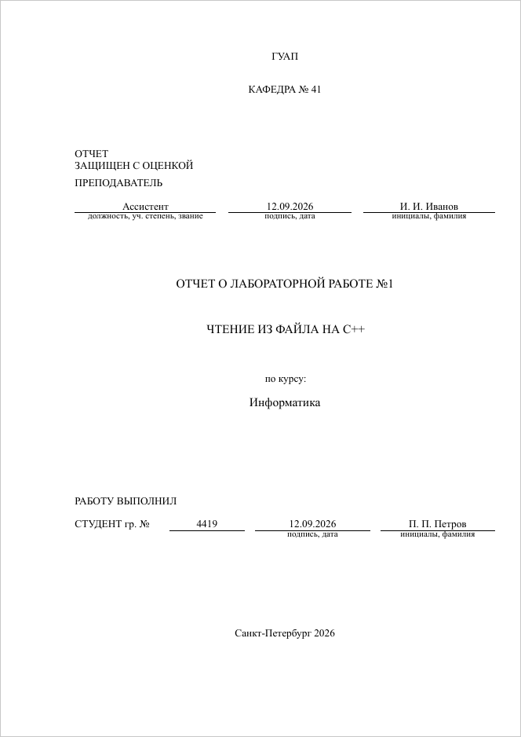

# Титульный лист

[← К оглавлению](../README.md#документация)

Титульный лист повторяет официальный бланк ГУАП. Данные задаются
в преамбуле командой `\suaisetup`, сам лист печатает `\maketitle`.

```latex
\suaisetup{
  department   = 41,
  teacher-post = Ассистент,
  teacher      = И. И. Иванов,
  type         = Отчет о лабораторной работе,
  number       = 1,
  title        = Чтение из файла на C++,
  course       = Информатика,
  group        = 4419,
  student      = П. П. Петров,
  date         = today,
}

\begin{document}
\maketitle
```

<p align="center">
  
</p>

## Ключи

| Ключ | Что это на бланке | По умолчанию |
| --- | --- | --- |
| `department` | номер кафедры: «КАФЕДРА № 41» | пусто |
| `teacher-post` | должность, учёная степень, звание преподавателя | пусто |
| `teacher` | инициалы и фамилия преподавателя | пусто |
| `type` | вид работы, печатается прописными | `Отчет о лабораторной работе` |
| `number` | номер работы после вида: «… № 1» | пусто — без номера |
| `title` | название работы, печатается прописными | пусто |
| `course-label` | строка над названием дисциплины | `по курсу:` |
| `course` | название дисциплины | пусто |
| `group` | номер группы | пусто |
| `student` | инициалы и фамилия студента; несколько — через запятую | пусто |
| `date` | дата рядом с подписями преподавателя и студента | пусто — линия для даты от руки |
| `city` | город внизу листа | `Санкт-Петербург` |
| `year` | год внизу листа | год сборки |

`\suaisetup` можно вызывать несколько раз: каждый вызов меняет только
названные ключи.

## Особые случаи

**Работа без номера** — курсовая, доклад, реферат: оставь `number` пустым.

```latex
  type   = Курсовая работа,
  number = ,
```

**Дата.** `date = today` ставит дату сборки в виде ДД.ММ.ГГГГ, готовую дату
пиши как есть: `date = 12.09.2026`. Без `date` на её месте остаются пустые
линии, чтобы вписать дату от руки.

**Несколько студентов** перечисляются через запятую, на бланке у каждого
своя строка с подписью:

```latex
  student = П. П. Петров, С. С. Сидоров,
```

**Запятые в значении** писать можно без скобок: запятая без знака `=`
продолжает значение.

```latex
  teacher-post = доцент, канд. техн. наук,
```

**Длинный текст над линией** (должность, фамилия) переносится на вторую
строку вверх, линия остаётся на месте. Длинное название работы занимает
несколько строк, отступы вокруг него сжимаются.

**Знак `=` в значении** — значение берётся в фигурные скобки, иначе его
начало станет именем ключа:

```latex
  title = {Расчёт y = kx},
```

**Специальные знаки** `% # & _` экранируются как обычно в LaTeX:
`\%`, `\#`, `\&`, `\_`. Команда `suai new --title "…"` делает это сама.

**Другая подпись над дисциплиной:**

```latex
  course-label = по дисциплине:,
```

## Что ещё делает `\maketitle`

- Правое поле титульного листа — 10 мм, как на бланке; у остальных страниц
  оно своё.
- Титульный лист считается первой страницей, но номер на нём не ставится:
  следующая страница получает номер 2.
- Название работы и первый студент записываются в свойства PDF как
  заголовок и автор.

Дальше: [текст отчёта](writing.md).
